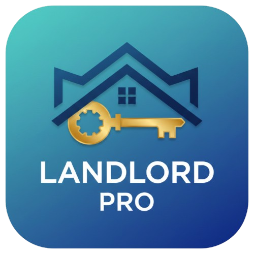

# 🏠 Landlord Pro

**Professionelle Mac-App zur Verwaltung und Abrechnung von Mietimmobilien**


<p align="center">
  
</p>

---

## 📋 Inhaltsverzeichnis

- [Features](#-features)
- [Screenshots](#-screenshots)
- [Installation](#-installation)
- [Erste Schritte](#-erste-schritte)
- [Funktionen im Detail](#-funktionen-im-detail)
- [Entwicklung](#-entwicklung)
- [Projektstruktur](#-projektstruktur)
- [Tech Stack](#-tech-stack)
- [Roadmap](#-roadmap)
- [Mitwirken](#-mitwirken)
- [Lizenz](#-lizenz)

---

## ✨ Features

### Immobilienverwaltung
- 🏢 Mehrfamilienhäuser mit Wohneinheiten
- 🏠 Einfamilienhäuser
- 🏬 Eigentumswohnungen
- 📍 Adressverwaltung und Gebäudedaten
- 📄 Dokumentenverwaltung pro Immobilie

### Mieterverwaltung
- 👤 Vollständige Mieterdaten (Kontakt, Bank, Vertrag)
- 👨‍👩‍👧 Zusätzliche Bewohner erfassen
- 📝 Mietverträge mit Start-/Enddatum
- 💳 Kautionsverwaltung
- ✉️ Korrespondenz-Historie

### Nebenkostenmanagement
- 📊 Kategorisierte Kostenerfassung
- 📅 Abrechnungsperioden (jährlich)
- 🔢 Verschiedene Verteilerschlüssel (Fläche, Personen, Einheiten)
- 🧾 Belegverwaltung mit Rechnungsdaten

### Nebenkostenabrechnung
- 🔮 **6-Schritt-Wizard** für einfache Abrechnung
- ⚖️ Automatische Berechnung der Anteile
- 📋 Übersichtliche Vorschau
- 📄 Export-Funktion (geplant: PDF)

### Instandhaltung
- 🔧 Aufgabenverwaltung mit Prioritäten
- 💰 Kostenverfolgung (Material, Arbeit)
- 👷 Handwerkerdaten speichern
- 📅 Termineplanung

### Datensicherung
- 💾 Backup als JSON-Datei
- 📥 Backup wiederherstellen
- 🗑️ Alle Daten zurücksetzen

---

## 📸 Screenshots

*Screenshots werden demnächst hinzugefügt*

---

## 📥 Installation

### macOS

1. Lade die neueste **DMG-Datei** von den [Releases](../../releases/latest) herunter
2. Öffne die DMG-Datei
3. Ziehe **Landlord Pro** in den **Applications**-Ordner
4. Starte die App aus dem Applications-Ordner

### ⚠️ Wichtig: Sicherheitswarnung beim ersten Start

Da die App nicht signiert ist, zeigt macOS eine Warnung an: *"Landlord Pro.app kann nicht geöffnet werden"*

**So öffnest du die App trotzdem:**

#### Option 1: Rechtsklick-Methode (empfohlen)
1. Klicke auf **"Fertig"** (nicht "In den Papierkorb legen"!)
2. Gehe zu **Applications** und finde "Landlord Pro"
3. **Rechtsklick** (oder Control + Klick) auf die App
4. Wähle **"Öffnen"** aus dem Kontextmenü
5. Klicke im Dialog auf **"Öffnen"**

#### Option 2: Systemeinstellungen
1. Öffne **Systemeinstellungen → Datenschutz & Sicherheit**
2. Scrolle nach unten zu "Sicherheit"
3. Du siehst: *"Landlord Pro wurde blockiert..."*
4. Klicke auf **"Trotzdem öffnen"**
5. Bestätige mit **"Öffnen"**

> **Hinweis:** Dies muss nur einmal gemacht werden. Danach öffnet sich die App normal.

---

## 🚀 Erste Schritte

### 1. Immobilie anlegen
- Klicke auf **Immobilien** in der Sidebar
- Klicke auf **+ Neue Immobilie**
- Fülle die Adresse und Gebäudedaten aus
- Bei Mehrfamilienhäusern: Füge Wohneinheiten hinzu

### 2. Mieter anlegen
- Klicke auf **Mieter** in der Sidebar
- Klicke auf **+ Neuer Mieter**
- Wähle die Immobilie und Einheit
- Erfasse Vertragsdaten und Miethöhe

### 3. Nebenkosten erfassen
- Klicke auf **Nebenkosten** in der Sidebar
- Wähle die Immobilie und das Jahr
- Erfasse die einzelnen Kosten nach Kategorie

### 4. Abrechnung erstellen
- Klicke auf **Abrechnung** in der Sidebar
- Starte den **Abrechnungs-Wizard**
- Folge den 6 Schritten zur fertigen Abrechnung

---

## 📖 Funktionen im Detail

### Verteilerschlüssel

| Schlüssel | Beschreibung | Typische Verwendung |
|-----------|--------------|---------------------|
| **Fläche** | nach m² Wohnfläche | Heizung, Versicherung, Grundsteuer |
| **Personen** | nach Bewohnerzahl | Müllentsorgung, Wasser |
| **Einheiten** | gleich pro Wohnung | Allgemeinstrom, Hausmeister |
| **Verbrauch** | nach Zählerstand | Heizung (70%), Wasser |

### Kostenarten

Die App unterstützt alle umlagefähigen Nebenkosten nach § 2 BetrKV:
- Heizkosten & Warmwasser
- Wasser & Abwasser
- Müllabfuhr
- Gebäudereinigung & Hausmeister
- Gartenpflege
- Gebäudeversicherung
- Grundsteuer
- Allgemeinstrom
- und weitere...

### Datenspeicherung

Alle Daten werden lokal auf Ihrem Mac gespeichert:
```
~/Library/Application Support/landlord-pro/
```

Die Daten werden in einer JSON-Datei gespeichert und können jederzeit als Backup exportiert werden.

---

## 💻 Entwicklung

### Voraussetzungen

- **Node.js** 20 oder höher
- **npm** 10 oder höher
- **macOS** (für Electron-Entwicklung)

### Installation

```bash
# Repository klonen
git clone https://github.com/andyholiday/landlord-pro.git
cd landlord-pro

# Dependencies installieren
npm install

# Entwicklungsserver starten
npm run dev
```

### Verfügbare Scripts

| Script | Beschreibung |
|--------|--------------|
| `npm run dev` | Startet den Entwicklungsserver mit Hot-Reload |
| `npm run build` | Baut die App für Produktion |
| `npm run typecheck` | TypeScript Typprüfung |
| `npm run lint` | ESLint Codeprüfung |

---

## 📁 Projektstruktur

```
landlord-pro/
├── .github/
│   └── workflows/
│       └── build.yml       # GitHub Actions für automatischen Build
├── build/
│   └── icon.png            # App-Icon (512x512)
├── electron/
│   ├── main.ts             # Electron Hauptprozess
│   └── preload.ts          # IPC Bridge zum Renderer
├── public/
│   └── logo.png            # Logo für die App
├── src/
│   ├── components/
│   │   ├── Billing/        # Abrechnungs-Komponenten
│   │   ├── Dashboard/      # Dashboard-Übersicht
│   │   ├── Expenses/       # Nebenkosten-Verwaltung
│   │   ├── Layout/         # Sidebar & Header
│   │   ├── Maintenance/    # Instandhaltung
│   │   ├── Properties/     # Immobilien-Verwaltung
│   │   ├── Settings/       # Einstellungen & Backup
│   │   ├── Shared/         # Wiederverwendbare UI-Komponenten
│   │   └── Tenants/        # Mieter-Verwaltung
│   ├── styles/
│   │   └── variables.css   # CSS-Variablen (Dark Theme)
│   ├── types/              # TypeScript Interfaces
│   ├── App.tsx             # Hauptkomponente mit Routing
│   └── main.tsx            # React Entry Point
├── package.json
├── tsconfig.json
└── vite.config.ts
```

---

## 🛠️ Tech Stack

| Technologie | Verwendung |
|-------------|------------|
| **Electron** | Desktop App Framework |
| **React 18** | UI Library |
| **TypeScript** | Type Safety |
| **Vite** | Build Tool & Dev Server |
| **React Router** | Client-side Routing |
| **electron-store** | Lokale Datenpersistenz |
| **date-fns** | Datumsformatierung |
| **jsPDF** | PDF-Generierung (geplant) |

---

## 🗺️ Roadmap

### Version 0.1.0
- [ ] PDF-Export für Nebenkostenabrechnungen
- [ ] Zählerstandsverwaltung
- [ ] Automatische Backup-Funktion

### Version 0.2.0
- [ ] Steuerberater-Export (Anlage V)
- [ ] Dokumenten-Upload
- [ ] Mehrsprachigkeit (EN)

### Version 1.0.0
- [ ] Apple Notarization & Code Signing
- [ ] Auto-Updates
- [ ] iCloud-Sync

---

## 🤝 Mitwirken

Beiträge sind willkommen! So kannst du helfen:

1. **Fork** das Repository
2. Erstelle einen **Feature-Branch** (`git checkout -b feature/AmazingFeature`)
3. **Commit** deine Änderungen (`git commit -m 'Add some AmazingFeature'`)
4. **Push** zum Branch (`git push origin feature/AmazingFeature`)
5. Öffne einen **Pull Request**

### Fehler melden

Gefunden Bugs? Öffne ein [Issue](../../issues/new) mit:
- Beschreibung des Problems
- Schritte zur Reproduktion
- Erwartetes vs. tatsächliches Verhalten
- macOS-Version und App-Version

---

## 📄 Lizenz

Dieses Projekt ist lizenziert unter der **MIT License** - siehe [LICENSE](LICENSE) für Details.

---

<p align="center">
  Made with ❤️ for German Landlords
</p>
